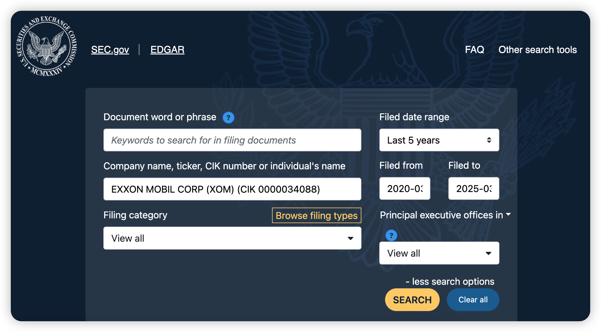
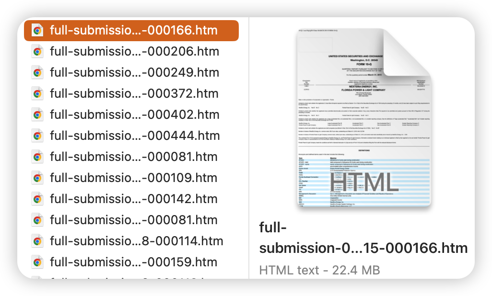
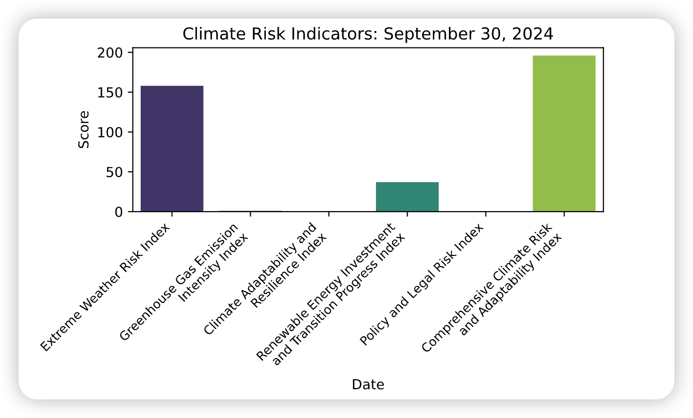
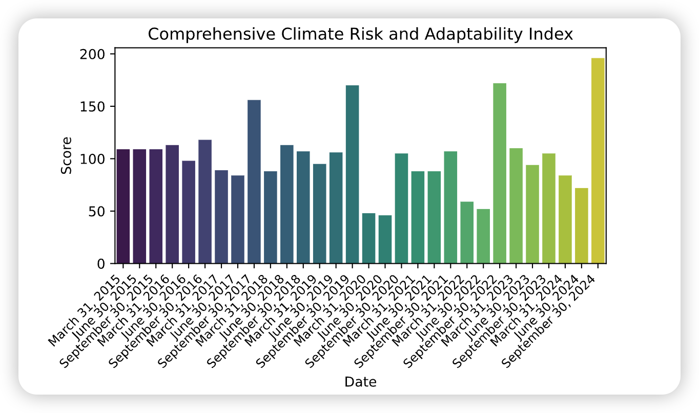
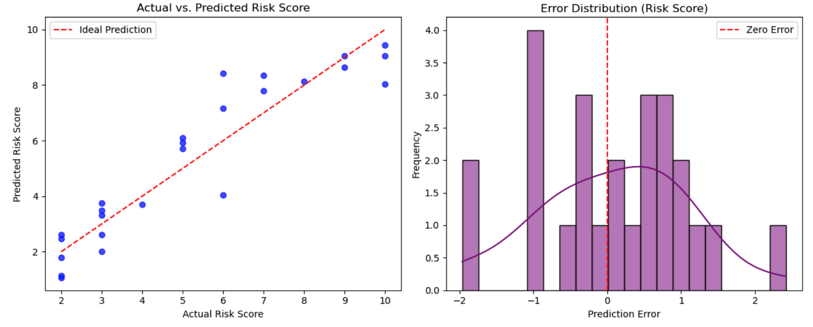
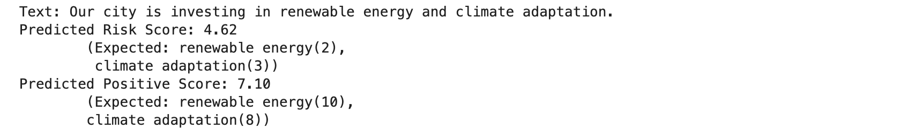

# **ClimateNLP**  

This repository contains a project comparing traditional methods (keyword frequency analysis) with AI-based approaches (BERT pre-trained model) for climate risk assessment.  

## **Overview**  
This repository provides implementations of various climate risk assessment techniques. The Jupyter Notebook (`.ipynb`) files included are:  

- **"1 Climate Risk Index Based on Keyword Frequency Technique.ipynb"** – Implements a traditional keyword frequency-based approach for climate risk assessment.  
- **"2 Climate Risk Assessment - Practical Application of the BERT Model.ipynb"** – Applies the BERT pre-trained model for a more advanced AI-driven climate risk analysis.  
- **"BERT 模型在气候风险评估上的实践.ipynb"** – Chinese version of the BERT-based approach (equivalent to file 2).  
- **"基于关键词词频技术的气候风险指数.ipynb"** – Chinese version of the keyword frequency-based method (equivalent to file 1).  
  
### **Installation**  
To set up the environment and install dependencies, run the following command:  
```bash
pip install -r requirements.txt
```

## Results

### Datasets
 

Download the 10-Q filing of NextEra Energy, Inc. (NEE), one of the largest renewable energy companies in the United States. In its 10-Q report, NextEra Energy may mention keywords such as “renewable energy,” “solar power,” “wind power,” “energy transition,” and “emission reduction target.” The company actively invests in low-carbon technologies and may disclose risks related to climate policies, such as “carbon pricing” or “climate regulation.”

We can develop code to automatically retrieve such filings from the SEC's EDGAR database, where reports are typically available in HTML format.

### Keyword Frequency Technique



These keyword frequencies reflect the level of attention given to various climate risk-related indices in the report. For example, the higher frequencies of the Extreme Weather Risk Index and Comprehensive Climate Risk and Adaptability Index indicate that these indices are discussed more extensively in the text. In contrast, the lower frequencies of the Greenhouse Gas Emission Intensity Index and Policy and Legal Risk Index suggest that they are less emphasized in the report. The zero frequency of the Climate Adaptability and Resilience Index indicates that this index was not mentioned at all in the text.

## BERT-based approach

Comparison of Actual and Predicted Risk Scores
The left image shows a scatter plot of the actual vs. predicted risk scores, with the red line representing the ideal prediction. The right image displays the distribution of prediction errors, with the purple curve representing the kernel density estimation and the red line indicating the zero error line.

 
The model is used to predict the risk score and positive score for the new text, “Our city is investing in renewable energy and climate adaptation.” The predicted scores are then compared with the expected scores for the keywords “renewable energy” and “climate adaptation.” This helps evaluate the model’s performance in handling new and complex sentences.

## Licenses
- Database: CC-BY 4.0: https://creativecommons.org/licenses/by/4.0/. 
- Code: MIT (https://choosealicense.com/licenses/mit/); year: 2025;
- Copyright holders: Xianghan Cao, Miao Tian, Shuhuai Li

## Contact
For any questions or inquiries, please contact: caoxianghan@gmail.com